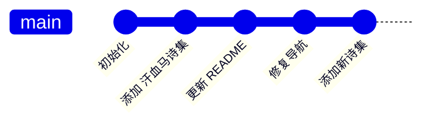

# 剑仙诗歌网站

这是一个基于 Zola 静态网站生成器构建的诗歌网站，收录了诗人李瑜的完整诗集。

**生产环境**: https://liyupoerty.com  
**开发环境**: https://github.com/lukethecat/lukethecat.github.io

---

## 项目概览

本网站由多本诗集组成，采用三层级浏览结构：
- **主页** → **诗集** → **章节** → **单首诗歌**

### 当前收录内容

#### 1. 1980 年诗集 (早期作品)
- **作者**: 李瑜
- **目录结构**: `content/1980/`
- **说明**: 包含作者早期创作和英文相关资料

#### 2. 1995 《汗血马》诗集 (核心内容)
- **作者**: 李瑜
- **出版年份**: 1995 年
- **目录结构**: `content/1995hanxuema/`
- **规模**: 
  - **21 个章节**
  - **101 首诗歌**
  - 涵盖中亚、西域、丝绸之路等主题
- **内容详情**:
  - 啊，中亚细亚新大陆 (5首)
  - 祁连山下已经沉寂 (6首)
  - 野罂粟 (5首)
  - 汗血马 (4首)
  - 楼兰骤然逝去 (4首)
  - 呀，贝加尔湖秋已深了 (4首)
  - 在苍茫的叶尔羌 (5首)
  - 烽火熄灭了 (4首)
  - 黑蓝的波斯湾 (4首)
  - 塔里木河之波 (5首)
  - 偷渡的托钵僧 (6首)
  - 诗魂还在飞驰 (5首)
  - 啊，塔拉斯会战 (5首)
  - 小孤城 (4首)
  - 绿宝石般的叶尔羌 (4首)
  - 静静的六盘山 (6首)
  - 奔腾的伊犁河 (5首)
  - 沙枣花般的买木热·爱孜木 (5首)
  - 啊，启明星 (6首)
  - 塞上赤子怆然涕下 (4首)
  - 西域父老谁不识君 (5首)

---

## 技术栈

| 组件 | 说明 |
|------|------|
| **Zola** | 静态网站生成器，使用 Rust 编写 |
| **GitHub Actions** | 自动化构建与部署 |
| **Cloudflare Pages** | 生产环境部署 |
| **TinySearch** | 浏览器端诗歌搜索索引 |
| **Make** | 构建自动化脚本 |
| **ImageMagick** | 图片尺寸调整与优化 |

---

## 本地开发

### 1. 安装依赖

```bash
# 安装 Zola (Mac)
brew install zola

# 验证安装
zola --version
```

### 2. 启动开发服务器

```bash
# 进入项目根目录
cd /Users/jellyfishjaco/Documents/Git\|Repo/liyupoerty.com-master

# 启动热重载开发服务器
zola serve

# 访问: http://127.0.0.1:11000
```

### 3. 构建生产版本

```bash
# 使用 Make 命令
make build
```

---

## 部署流程

### 自动化部署 (推荐)

1. **推送代码到 GitHub**
   ```bash
   git add .
   git commit -m "你的改动说明"
   git push origin master
   ```

2. **GitHub Actions 自动触发**
   - 代码推送到 `master` 分支时自动构建
   - 构建完成后部署到 Cloudflare Pages

3. **监控部署状态**
   - GitHub Actions: https://github.com/lukethecat/lukethecat.github.io/actions
   - Cloudflare Pages: https://dash.cloudflare.com/endler-dev

### 手动部署 (测试用)

```bash
# 构建网站
zola build

# 部署到 Cloudflare Pages
# 使用 Cloudflare 教程或 GitHub Actions 重新运行
```

---

## 文件结构

```
liyupoerty.com-master/
├── .github/workflows/ci.yml    # GitHub Actions 配置
├── config.toml                 # Zola 全局配置
├── Makefile                    # 构建脚本
├── README.md                   # 项目说明 (本文件)
├── website-maintenance-manual.md  # LLM/开发者维护指南 (重要!)
├── content/                    # 网站内容
│   ├── _index.md              # 首页内容
│   ├── static/                # 静态页面 (about, archive)
│   ├── 1980/                  # 1980 诗集
│   └── 1995hanxuema/          # 汗血马诗集
│       ├── _index.md         # 诗集元数据
│       ├── 汗血马 李瑜 QWEN校对20260203.md  # 完整内容源
│       ├── 啊-中亚细亚新大陆/
│       │   ├── _index.md     # 章节索引
│       │   ├── 那辉煌箭矢一定还在飞驰.md  # 单首诗歌
│       │   └── ...           # 其他96首诗歌
│       └── ...               # 其他20个章节
├── templates/                 # Zola 页面模板
│   ├── index.html            # 首页模板
│   ├── section.html          # 目录/章节模板
│   └── page.html             # 内容页面模板
├── static/                    # 静态资源
│   ├── css/                  # 样式表
│   ├── images/               # 图片
│   │   ├── covers/          # 书籍封面存放目录
│   │   │   ├── 1980/        # 1980 诗集封面
│   │   │   └── 1995hanxuema/  # 汗血马封面
│   │   └── ...              
│   └── js/                   # JavaScript 文件
├── helpers/                  # 构建辅助脚本
├── generate_poetry_pages.py  # 自动生成诗歌页面脚本
└── lukethecat.github.io/      # 子仓库 (git 子模块)
```

---

## 添加诗句页面

### 使用生成脚本 (批量创建)

如果需要为新诗集添加 100+ 首诗歌：

```bash
# 准备源文件
# 例如: content/新诗集名/新诗集 源文件.md

# 修改 generate_poetry_pages.py 中的配置
# 主要修改: CHAPTERS 数组、BOOK_DIR、BOOK_NAME

# 运行生成
python3 generate_poetry_pages.py

# 查看结果
ls -la content/新诗集名/
```

### 手动创建单首诗歌

在对应的章节目录下创建 `{title}.md` 文件：

```markdown
+++
title = "诗歌标题"
date = 2000-01-01
weight = 1
insert_anchor_links = "left"
+++

# 诗歌标题

诗歌内容...
```

---

## 书籍封面支持

### 存放位置

```
static/images/covers/
├── 1980/
│   ├── cover.jpg (400x600px)
│   └── thumbnail.jpg (200x300px)
└── 1995hanxuema/
    ├── cover.jpg
    └── thumbnail.jpg
```

### 添加封面

```bash
# 确保目录存在
mkdir -p static/images/covers/1995hanxuema

# 复制封面图片
cp book-cover.jpg static/images/covers/1995hanxuema/cover.jpg
```

**推荐尺寸**:
- 主封面: 400x600px (JPG/PNG)
- 缩略图: 200x300px

---

## 维护手册

**重要**: 此文件仅供快速参考。完整的维护指南请查阅：

### [`website-maintenance-manual.md`](./website-maintenance-manual.md)

该手册包含：
- 🔧 详细介绍所有技术栈
- 🛠️ 完整的部署流程
- 🚨 故障排查指南
- 📋 每次更新后的检查清单
- 🔄 内容管理的最佳实践

**规则**: **每次更新网站后**，必须同步更新维护手册和此 README。

---

## 构建流程



构建步骤 (自动执行):
1. `gh-stats` - 生成 GitHub 统计
2. `zola build` - 构建静态网站内容
3. `tinysearch` - 生成搜索索引 (Wasm)
4. 部署到 Cloudflare Pages

---

## 故障排查

| 问题 | 解决方案 |
|------|----------|
| **构建失败** | 检查 `content/` 下所有 `_index.md` 文件的前端元数据格式 |
| **404 页面** | 确保章节文件夹命名与 `config.toml` 中路径匹配 |
| **搜索功能失效** | 重新运行 `make search` 或检查 Wasm 文件 |
| **图片不显示** | 检查 `static/images/covers/` 目录结构 |

**高级调试**:
```bash
# 查看构建日志
zola build --verbose

# 检查 Git 状态
git status
git log --oneline -5
```

---

## 赞助商与鸣谢

- **Cloudflare Pages**: 可靠的静态网站托管
- **GitHub Actions**: 自动化 CI/CD
- **Zola 社区**: 优秀的静态网站生成器

---

## 联系信息

- **作者**: 李瑜
- **网站**: https://liyupoerty.com
- **GitHub**: https://github.com/lukethecat

---

## 许可证

© 李瑜 2025 版权所有  
本诗歌作品为原创，未经作者明确书面许可，不得擅自转载、复制、改编或用于任何商业用途。

---

**版本**: 1.0  
**更新时间**: 2026-02-04  
**维护者**: [开发者团队]

```
